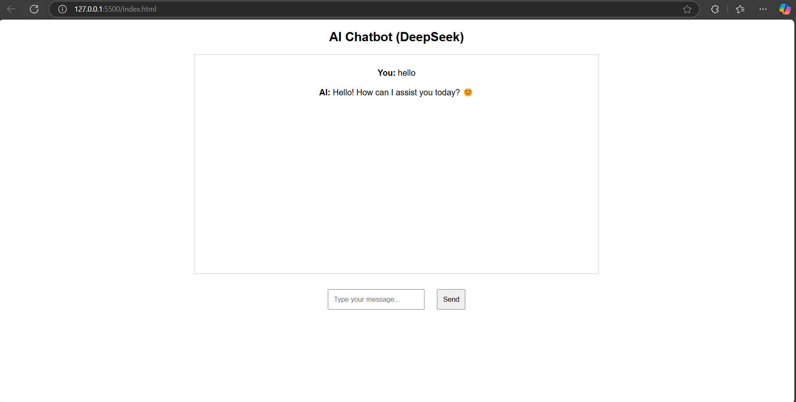

# AI Chatbot using DeepSeek (7B) with Streaming

This is a simple AI chatbot that utilizes the **DeepSeek-R1:7B** model hosted locally via **Ollama**. It features real-time streaming responses and a user-friendly web interface.

## 🚀 Features
- **Real-time Streaming Responses** 🏃‍♂️
- **Simple API with Express.js** 📡
- **Frontend with Vanilla JavaScript** 🖥️
- **Clean & Minimal UI** ✨

## 🛠️ Installation

### 1️⃣ Install & Run DeepSeek Model via Ollama
Make sure you have **Ollama** installed and running:
```sh
ollama pull deepseek-r1:7b
ollama run deepseek-r1:7b
```

### 2️⃣ Clone This Repository
```sh
git clone https://github.com/your-username/your-repo.git
cd your-repo
```

### 3️⃣ Install Dependencies
```sh
npm install
```

### 4️⃣ Run the Backend Server
```sh
node server.js
```

### 5️⃣ Open `index.html` in Your Browser
Now you can start chatting with the AI! 🎉

## 📜 API Endpoints
### `POST /chat`
- **Description**: Sends a user query to DeepSeek and streams the response.
- **Request Body (JSON)**:
  ```json
  {
    "message": "Hello, how are you?"
  }
  ```
- **Response (Text - Streaming)**:
  ```
  AI: I am doing great! How can I assist you today?
  ```

## 📸 Preview



